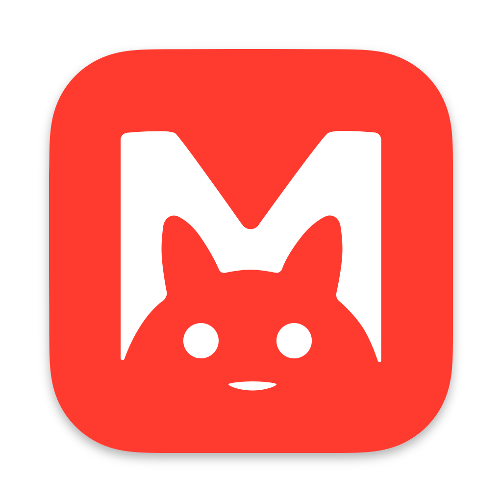
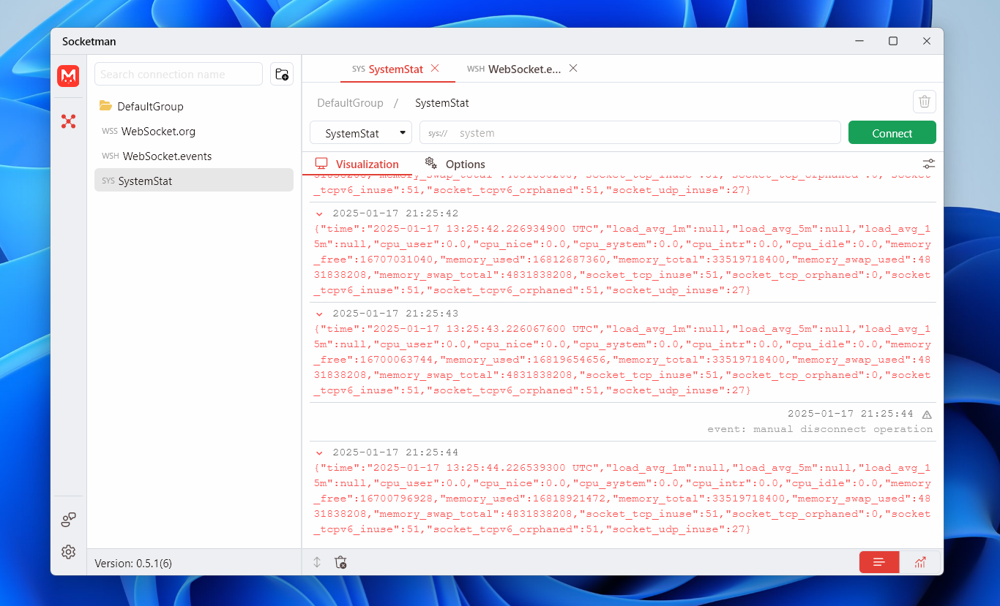
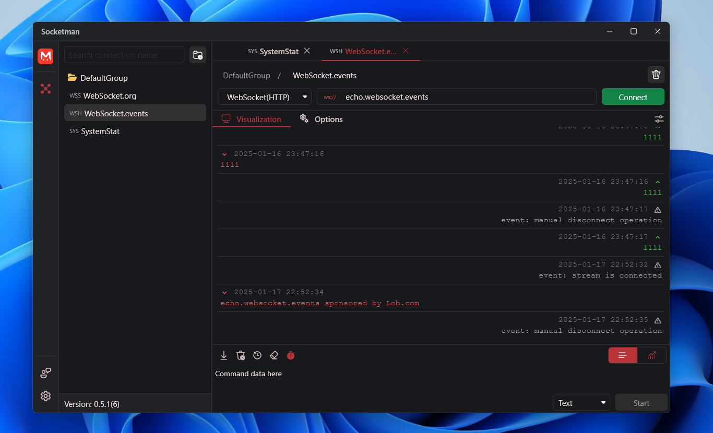

# Socketman

[中文版本](./README_CN.md)

⚠️ **Note: Socketman is a non-open source project, this repository is only used to manage requirements and user feedback.**

Website: https://socketman.app

## Documentation

https://socketman.app/en/guide

## Download

[Microsoft Store](https://apps.microsoft.com/store/detail/9NN916NB3WTT?cid=DevShareMCLPCS)

[v0.6.0](https://github.com/socketmanapp/desktop/releases/tag/v0.6.0)

[v0.5.0](https://github.com/socketmanapp/desktop/releases/tag/v0.5.0)
