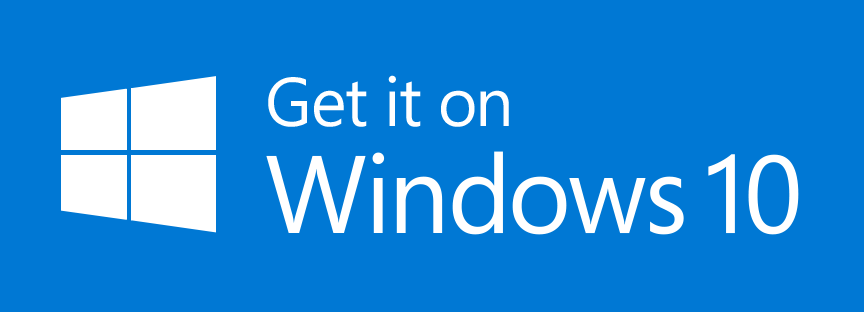

# Socketman

[中文版本](./README_CN.md)

⚠️ **Note: Socketman is a non-open source project, this repository is only used to manage requirements and user feedback.**

Website: https://socketman.app

## Introduction

Socketman is a modern, aesthetically pleasing, lightweight, and high-performance network and serial data debugging tool that aims to provide efficient and professional data debugging software for developers.

### Features

- 💻 Native Desktop(Windows, macOS, *Linux*) App, Writeten by Flutter+Rust, Powered by Rust for the high-performance network/drive application.
- 🖥️ Built for MacOS Ventura & Sonoma, Windows 10
- 🎊 Modern and intuitive UI
- ✨ Mainstream protocols: WebSocket, TCP, UDP, etc., and will continue to support more protocols in future versions;
- ✨ Presenting data in various text formats such as Hex, String, JSON, Monspack, Protobuf, etc;
- ✨Displaying data in graphical form, including waveform and line charts;
- 🎇 Built on the Flutter cross platform framework and Rust language, and has excellent performance.

## Screenshots

## Documentation

https://socketman.app/en/guide

## Get Socketman App

### App Store

### GitHub Releases

[v0.6.0](https://github.com/socketmanapp/desktop/releases/tag/v0.6.0)

[v0.5.0](https://github.com/socketmanapp/desktop/releases/tag/v0.5.0)
