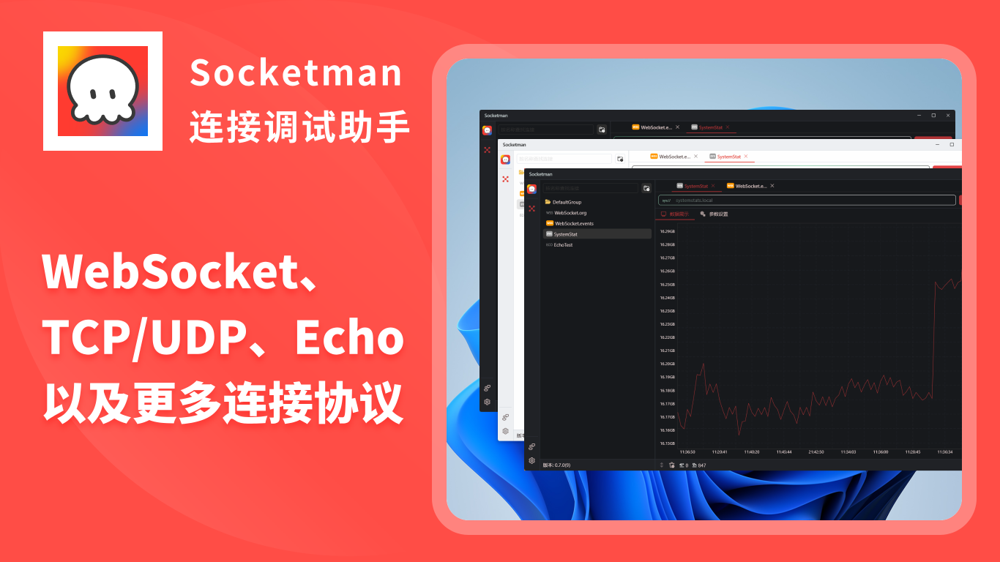
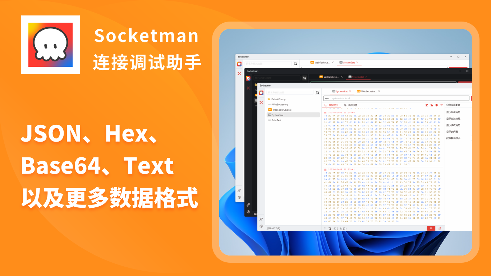
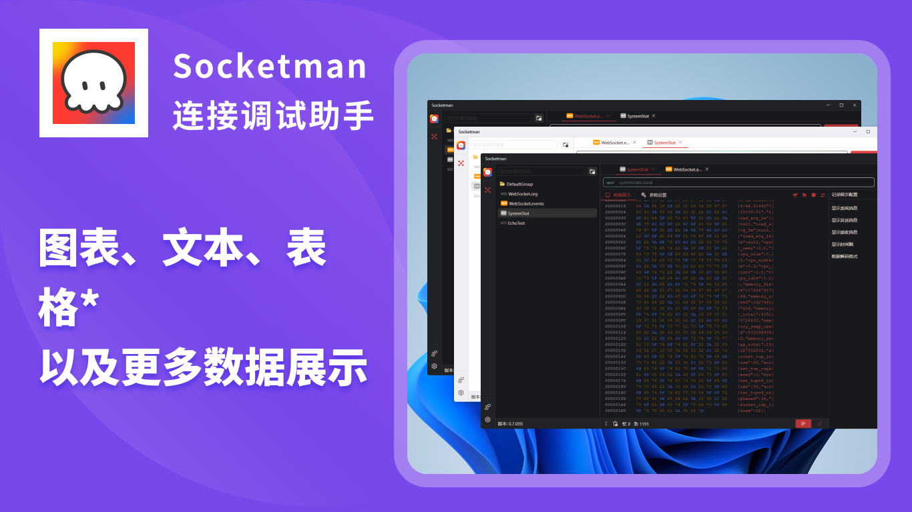

# Socketman

[简体中文](./README_CN.md) | [繁体中文](./README_HK.md) | [English](./README.md)

⚠️ **注意：Socketman是非开源项目，本仓库仅用来管理需求和用户反馈。**

官方网站: https://socketman.app

## Socketman 介绍

Socketman是一款现代化的界面美观且轻量级高性能的网络和串口数据调试工具，它的目标是为广大开发者提供高效专业的数据调试软件。

### 功能特性

- 💻 原生性能桌面(Windows, macOS, *Linux*) 应用, 基于Flutter+Rust打造, 使用Rust构建的高性能网络调试工具.
- 🖥️ 构建支持 MacOS Ventura & Sonoma和 Windows 10
- 🎊 现代化的、漂亮的界面
- ✨ 主流协议: WebSocket, TCP, UDP等，后续版本中会持续支持更多协议
- ✨ 将数据以Hex、String、JSON、 Msgpack、Protobuf等多种文本格式呈现
- ✨ 将数据以图表化绘图显示，支持波形图、折线图等图表类型；
- 🎇 基于Flutter跨平台框架和Rust语言来构建，具备非常优秀的性能表现。

## 程序界面截图

## 使用文档

https://socketman.app/guide

## 安装 Socketman App

### 应用市场 App Store

### GitHub Releases

[v0.7.0](https://github.com/socketmanapp/desktop/releases/tag/v0.7.0)

[v0.5.0](https://github.com/socketmanapp/desktop/releases/tag/v0.5.0)
