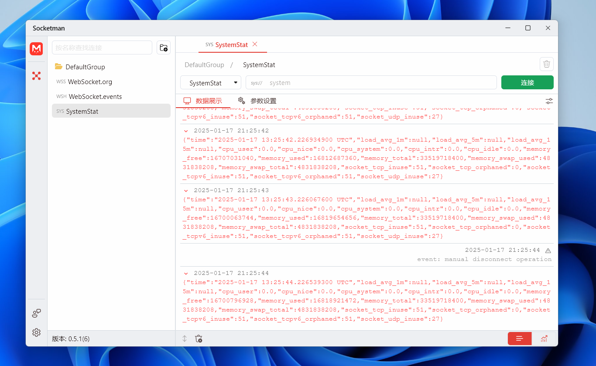
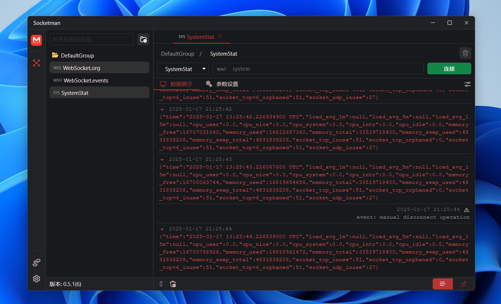

# Socketman

[English](./README.md)

⚠️ **注意：Socketman是非开源项目，本仓库仅用来管理需求和用户反馈。**

Website: https://socketman.app

## Socketman 介绍

Socketman是一款专为Windows和MacOS操作系统设计的桌面软件，旨在提供高效、专业的网络通信支持和调试功能。它支持WebSocket、TCP、UDP等主流协议，并持续拓展更多协议以满足未来需求。软件界面性能卓越，可将Socket数据以Hex、Base64、Msgpack等多种文本格式精准呈现，同时支持数据图表化展示，助力深度分析。

## 程序界面截图

## 使用文档

https://socketman.app/guide

## 下载安装

[Microsoft Store](https://apps.microsoft.com/detail/9nn916nb3wtt?cid=DevShareMCLPCS&hl=zh-cn)

[Github Release: v0.6.0](https://github.com/socketmanapp/desktop/releases/tag/v0.6.0)

[Github Release: v0.5.0](https://github.com/socketmanapp/desktop/releases/tag/v0.5.0)
