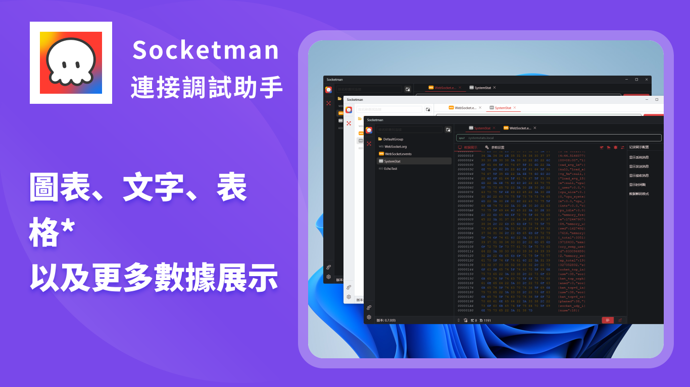

# Socketman

[简体中文](./README_CN.md) | [繁体中文](./README_HK.md) | [English](./README.md)

⚠️ **注意：Socketman是非開源項目，本倉庫僅用來管理需求和用戶反饋。**

## Socketman 介紹

Socketman是一款現代化的界面美觀且輕量級高性能的網絡和串口數據調試工具，它的目標是為廣大開發者提供高效專業的數據調試軟件。

官方網站: [https://socketman.app/hk](https://socketman.app/hk)

### 功能特性

- 支持WebSocket、TCP、UDP等主流協議，在後續版本中會持續支持更多協議；
- 支持將數據以Hex、String、JSON、 Msgpack、Protobuf等多種文本格式呈現；
- 支持將數據以圖表化繪圖顯示，支持波形圖、折線圖等圖表類型；
- 基於Flutter跨平台框架和Rust語言來構建，具備非常優秀的性能表現。

## 下載安裝

### 从 Windows 10 / Microsoft Store 下載安裝

- 
- 

### 从 GitHub Release 下載安裝

- 

## 程序界面截圖

## 使用文檔

https://socketman.app/guide

## 安裝 Socketman App

### 應用市場 App Store

### GitHub Releases

- [v0.7.0](https://github.com/socketmanapp/desktop/releases/tag/v0.7.0)
- [v0.6.0](https://github.com/socketmanapp/desktop/releases/tag/v0.6.0)
- [v0.5.0](https://github.com/socketmanapp/desktop/releases/tag/v0.5.0)
